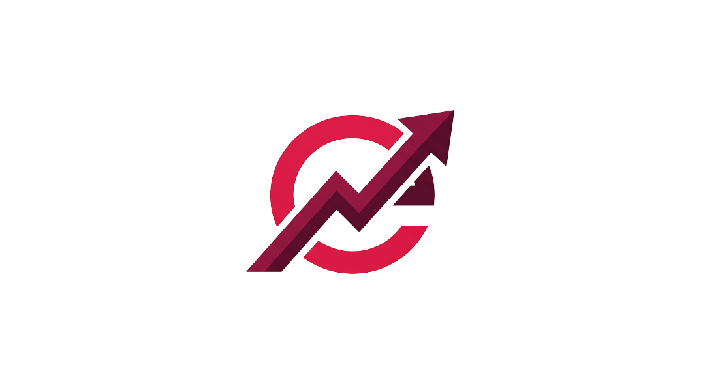
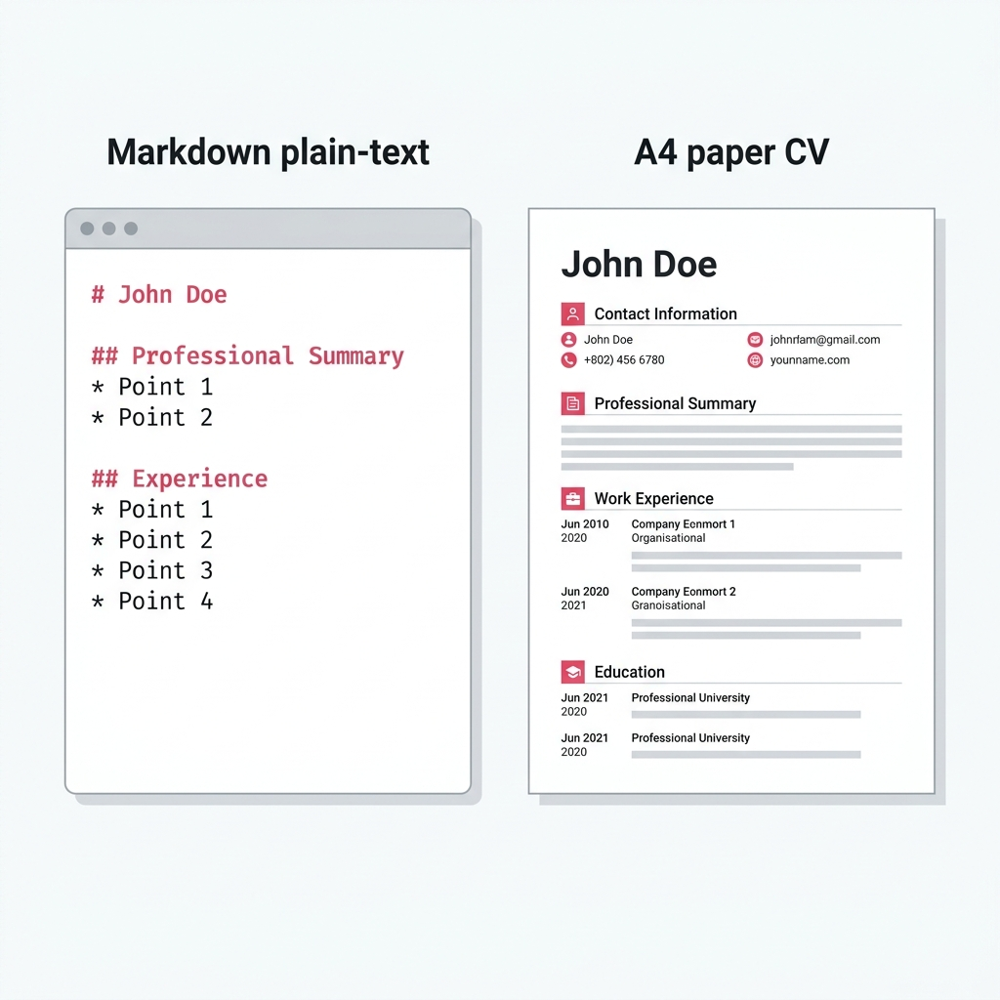
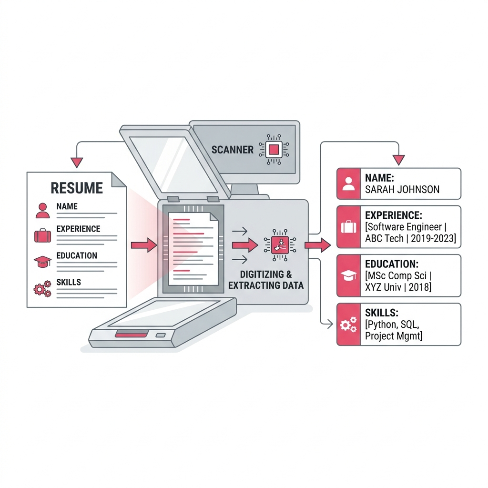
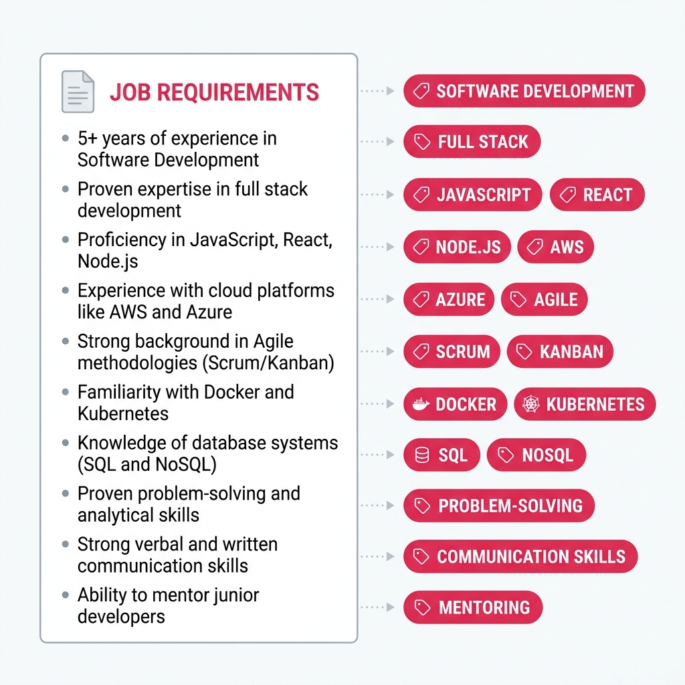

<div align="center">
  
  <h1>CVEngine 🚀</h1>
  <p><strong>The Ultimate ATS-Friendly Markdown to PDF Resume Builder</strong></p>
  
  <p>
    <a href="https://nextjs.org/"></a>
    <a href="https://reactjs.org/"></a>
    <a href="https://tailwindcss.com/"></a>
    <a href="https://www.typescriptlang.org/"></a>
  </p>
  <p>
    <a href="https://github.com/baasith6/cvengine/actions/workflows/ci.yml"></a>
    <a href="https://github.com/baasith6/cvengine/network/dependencies"></a>
    <a href="https://github.com/baasith6/cvengine/blob/main/LICENSE"></a>
  </p>

  <p>
    <a href="#features">Features</a> •
    <a href="#how-it-works">How it Works</a> •
    <a href="#getting-started">Getting Started</a> •
    <a href="#contributing">Contributing</a>
  </p>
</div>

---

## 🌟 Why CVEngine?

Creating an ATS (Applicant Tracking System) friendly resume shouldn't be a hassle. **CVEngine** empowers developers, designers, and professionals to build perfectly structured, beautifully rendered, and 100% ATS-readable resumes using simple Markdown. 

Stop wrestling with Word documents and complex design tools. Write in Markdown, preview live, and export to a pristine PDF in seconds.

## ✨ Key Features

- 📝 **Markdown First:** Write your resume in standard Markdown. Keep it in version control.
- 👁️ **Live Preview:** See your resume render in real-time as you type.
- 🤖 **ATS-Optimized:** Generates clean, parseable PDFs that Applicant Tracking Systems love.
- 🎨 **Beautiful Defaults:** Professional typography and layouts right out of the box.
- ⚡ **Lightning Fast:** Built on Next.js 14 and React for instantaneous rendering.
- 🔒 **Privacy Focused:** Everything runs in your browser. Your data stays yours.

## 📸 Sneak Peek

### Markdown to PDF Magic


### ATS Parsing & Keyword Matching



---

## 🚀 Getting Started

Follow these instructions to get a copy of the project up and running on your local machine.

### Prerequisites
Make sure you have Node.js installed (v18.x or later is recommended).

### Installation

1. **Clone the repository:**
   ```bash
   git clone https://github.com/baasith6/cvengine.git
   cd cvengine
   ```

2. **Install dependencies:**
   ```bash
   npm install
   # or yarn install / pnpm install / bun install
   ```

3. **Run the development server:**
   ```bash
   npm run dev
   ```

4. **Open your browser:**
   Navigate to [http://localhost:3000](http://localhost:3000) to see the application in action!

---

## 📈 How to Make This Repo Rank Higher (SEO & GitHub Optimization)

To help this repository reach more people, make sure to add the following **Topics (Tags)** in your repository settings on GitHub. Click the ⚙️ icon next to "About" on the right side of the repo page and add these:

`resume-builder`, `cv-generator`, `markdown-to-pdf`, `ats-friendly`, `nextjs`, `react`, `resume`, `cv`, `markdown`, `productivity-tools`, `open-source`

**Also, encourage users to:**
- ⭐ **Star** the repository if they find it useful!
- 🍴 **Fork** it and contribute to the code.
- 🌐 Share the deployed version on Twitter, LinkedIn, and Reddit.

## 🛠️ Tech Stack

- **Framework:** [Next.js](https://nextjs.org/) (App Router)
- **Language:** [TypeScript](https://www.typescriptlang.org/)
- **Styling:** [Tailwind CSS](https://tailwindcss.com/)
- **Icons:** Lucide React / Framer Motion for animations
- **Deployment:** [Vercel](https://vercel.com/) (Deployed at `cvengine.space`)

## 🤝 Contributing

Contributions are what make the open source community such an amazing place to learn, inspire, and create. Any contributions you make are **greatly appreciated**.

1. Fork the Project
2. Create your Feature Branch (`git checkout -b feature/AmazingFeature`)
3. Commit your Changes (`git commit -m 'Add some AmazingFeature'`)
4. Push to the Branch (`git push origin feature/AmazingFeature`)
5. Open a Pull Request

## 📄 License

Distributed under the MIT License. See `LICENSE` for more information.

---
<div align="center">
  Made with ❤️ by Abdul Baasith
</div>
